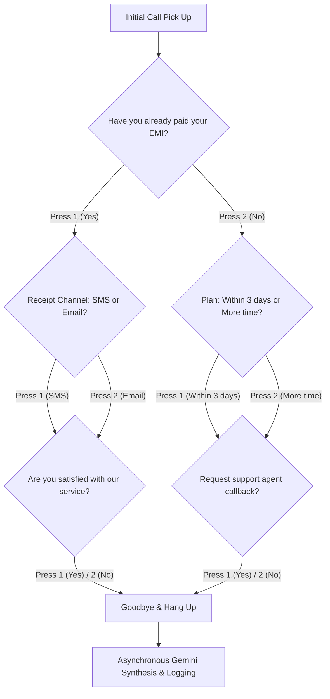

#  IVR Regulator — AI-Powered Loan Collection & Reminder SaaS

**IVR Regulator** is a modern, premium AI-powered outbound IVR (Interactive Voice Response) SaaS platform designed for loan reminders, EMI recovery, and borrower communication. 

telephony testing can be complex and expensive. **IVR Regulator** resolves this by embedding a state-of-the-art **In-Browser Outbound Call Simulator** complete with browser-based Speech-to-Text, Web Speech Synthesis, realistic telephone DTMF tone generators, and an asynchronous **Google Gemini AI** analysis pipeline.

---

##  Key Features

* **Sleek Dark Mode Dashboard**: Rich glassmorphism aesthetics, live KPI metrics (recovery rates, promised payments, active dialer states), and historical metrics charts using Recharts.
* **In-Browser Call Simulator Dialer**:
  * Realistic telephone DTMF soundwaves (Web Audio API frequency oscillators).
  * Web Speech Synthesis (Text-to-Speech) for automated IVR prompts.
  * Microphone Speech Recognition (Speech-to-Text) fallback.
  * Symmetrical, 100% reliable keypad dial flow (pressing `1` or `2` to answer questions).
* **Deep Google Gemini AI Integration**: Custom OpenAI compatible SDK layer pointing directly to Gemini's `gemini-1.5-flash` model, compiling call transcripts, analyzing sentiment (positive, neutral, negative, hostile), and flagging account escalations automatically.
* **Persistent Borrower Directory**: Add borrowers manually or bulk upload via CSV files.

---

##  Symmetrical Dialer Conversation Flow

To maximize reliability across all browsers and environments, the simulator implements a symmetrical **3-question keypad DTMF (1/2)** dialogue flow.



---

##  Technology Stack

* **Backend**: Node.js, Express, MongoDB (Mongoose), Twilio SDK, OpenAI SDK (configured for Gemini compatibility).
* **Frontend**: React (Vite), Tailwind CSS, React Icons (Heroicons 2), Recharts, Axios, Web Speech API (Synthesis & Recognition).

---

##  Setup & Installation Instructions

### Prerequisites
* [Node.js](https://nodejs.org/) (v16.0.0 or higher)
* [MongoDB](https://www.mongodb.com/) (Local installation or MongoDB Atlas cluster connection URI)

---

### 1. Backend Setup

Navigate to the backend directory and install dependencies:
```bash
cd backend
npm install
```

Create a `.env` file in the `backend/` directory:
```env
Start the backend API dev server:
```bash
npm run dev
```
*The server will boot on port 5000 and automatically seed the MongoDB database with 20 sample accounts if empty.*

---

### 2. Frontend Setup

Navigate to the frontend directory and install dependencies:
```bash
cd ../frontend
npm install
```

Create a `.env` file in the `frontend/` directory

## DEMO 
The Live working of the project can be accessed using the below -:
https://drive.google.com/file/d/1rwSKL_OJ2Chx1OD0vvv8JTydmqi9TLQS/view?usp=sharing

## Note
In this demo, The call is simulated because, the actual APIs of Twilio or other providers which help in IVR calls, were paid or only the US numbers were allowed, 
In the hidden .env files, the commented gateway for the whole calling has been created, when given a paid access to these APIs, the app could fully funtional like specified, But the demo has a call simulator along with integrated MongoDB and Gemini Free APIs.
